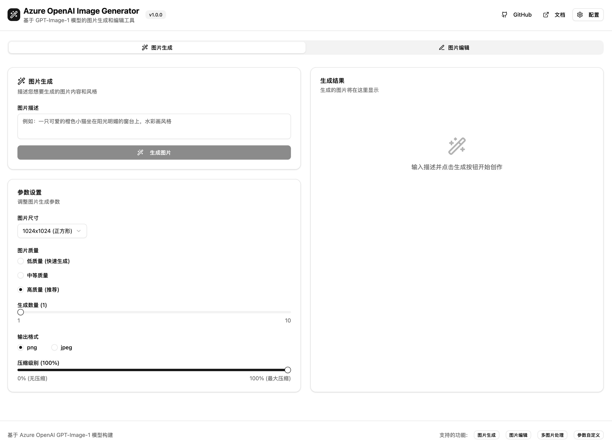

# Azure OpenAI Image Generator

一个基于 Azure OpenAI GPT-Image-1 模型的现代化图片生成和编辑工具。支持完整的参数配置、多图片处理和 Docker 容器化部署。

[](https://github.com/ottodeng/azure-openai-image-app)
[](https://github.com/ottodeng/azure-openai-image-app/stargazers)
[](https://github.com/ottodeng/azure-openai-image-app/network)

## 🌟 功能特性

### 🎨 图片生成
- **智能文本转图片**: 基于自然语言描述生成高质量图片
- **多种尺寸支持**: 1024x1024 (正方形)、1024x1536 (竖版)、1536x1024 (横版)
- **质量控制**: 低、中、高三种质量级别，默认高质量
- **批量生成**: 一次生成 1-10 张图片
- **格式选择**: 支持 PNG (默认) 和 JPEG 输出格式
- **压缩控制**: 0-100% 可调节压缩级别
- **实时反馈**: 加载悬浮框提供清晰的操作状态反馈

### ✏️ 图片编辑
- **多图片上传**: 支持同时上传多张图片进行编辑
- **智能编辑**: 基于文本描述对图片进行修改
- **保真度控制**: 低保真度(更多创意变化) 和 高保真度(保持原图特征)
- **蒙版支持**: 支持上传 PNG 蒙版文件精确控制编辑区域
- **拖拽上传**: 直观的拖拽式文件上传体验
- **加载状态**: 编辑过程中的清晰视觉反馈

### 🛠️ 高级功能
- **参数预设**: 保存和加载常用参数配置
- **历史记录**: 自动保存生成和编辑历史
- **图片画廊**: 优雅的图片展示和管理界面
- **一键下载**: 支持单张和批量下载
- **提示词复制**: 快速复制修订后的提示词
- **响应式设计**: 完美适配桌面、平板和移动设备

## � 页面展示



## �🛠 技术栈

- **前端框架**: React 18 + JavaScript
- **UI 组件**: shadcn/ui + Tailwind CSS
- **状态管理**: React Context + useReducer
- **HTTP 客户端**: Axios
- **文件处理**: React Dropzone
- **构建工具**: Vite
- **容器化**: Docker + Nginx
- **图标库**: Lucide React

## 🚀 快速开始

### 前置要求

- Node.js 18+ 
- pnpm (推荐) 或 npm
- Docker & Docker Compose (可选)
- Azure OpenAI 服务账户和 API 密钥

### 方法一：本地开发

1. **克隆项目**
   ```bash
   git clone https://github.com/ottodeng/azure-openai-image-app.git
   cd azure-openai-image-app
   ```

2. **安装依赖**
   ```bash
   pnpm install --config.strict-peer-dependencies=false
   ```

3. **配置环境变量**
   ```bash
   cp .env.example .env
   # 编辑 .env 文件，填入你的 Azure OpenAI 配置
   ```

4. **启动开发服务器**
   ```bash
   pnpm run dev
   ```

5. **访问应用**
   打开浏览器访问 `http://localhost:5173`

### 方法二：Docker 部署 (推荐)

1. **克隆项目**
   ```bash
   git clone https://github.com/ottodeng/azure-openai-image-app.git
   cd azure-openai-image-app
   ```

2. **配置环境变量**
   ```bash
   cp .env.example .env
   # 编辑 .env 文件，填入你的 Azure OpenAI 配置
   ```

3. **使用快速启动脚本**
   ```bash
   ./start.sh
   ```
   
   或手动执行：
   ```bash
   docker-compose up -d --build
   ```

4. **访问应用**
   打开浏览器访问 `http://localhost:3000`

### 方法三：纯 Docker 命令

```bash
# 构建镜像
docker build -t azure-openai-image-app .

# 运行容器
docker run -d -p 3000:8080 \
  --env-file .env \
  --name azure-openai-image-app \
  azure-openai-image-app
```

## 配置说明

### Azure OpenAI 配置

在应用界面右上角点击"配置"按钮，填入以下信息：

- **服务端点**: 您的 Azure OpenAI 资源端点 (例如: `https://your-resource.openai.azure.com`)
- **API 密钥**: Azure OpenAI 服务的 API 密钥
- **部署名称**: GPT-Image-1 模型的部署名称 (默认: `gpt-image-1`)
- **API 版本**: API 版本 (默认: `2025-04-01-preview`)

### 环境变量 (可选)

如果需要预设配置，可以通过环境变量设置。在项目根目录创建 `.env` 文件：

```bash
# 复制示例文件
cp .env.example .env
```

然后在 `.env` 文件中设置以下变量：

```bash
VITE_AZURE_OPENAI_ENDPOINT=https://your-resource.openai.azure.com
VITE_AZURE_OPENAI_API_KEY=your-api-key
VITE_AZURE_OPENAI_DEPLOYMENT=gpt-image-1
VITE_AZURE_OPENAI_API_VERSION=2025-04-01-preview
```

**注意**: `.env` 文件包含敏感信息，请勿提交到版本控制系统。

## API 参数说明

### 图片生成参数

| 参数 | 类型 | 默认值 | 说明 |
|------|------|--------|------|
| `prompt` | string | - | 图片描述文本 (必填) |
| `size` | string | "1024x1024" | 图片尺寸 |
| `quality` | string | "high" | 图片质量 (low/high) |
| `n` | number | 1 | 生成数量 (1-10) |
| `output_format` | string | "png" | 输出格式 (png/jpeg/webp) |
| `output_compression` | number | 100 | 压缩级别 (0-100) |

### 图片编辑参数

除了生成参数外，还包括：

| 参数 | 类型 | 默认值 | 说明 |
|------|------|--------|------|
| `images` | File[] | - | 输入图片文件 (必填) |
| `input_fidelity` | string | "high" | 输入保真度 (low/high) |
| `mask` | File | - | 蒙版文件 (可选) |

## 项目结构

```
azure-openai-image-app/
├── src/
│   ├── components/          # React 组件
│   │   ├── ConfigPanel.jsx  # 配置面板
│   │   ├── ImageGeneration.jsx # 图片生成
│   │   ├── ImageEdit.jsx    # 图片编辑
│   │   ├── ImageGallery.jsx # 图片画廊
│   │   └── ParameterPanel.jsx # 参数面板
│   ├── contexts/            # React Context
│   │   └── AppContext.jsx   # 应用状态管理
│   ├── services/            # 服务层
│   │   └── azureOpenAI.js   # Azure OpenAI API 服务
│   ├── types/               # 类型定义
│   │   └── api.js           # API 相关类型
│   └── App.jsx              # 主应用组件
├── public/                  # 静态资源
├── Dockerfile              # Docker 配置
├── docker-compose.yml      # Docker Compose 配置
├── nginx.conf              # Nginx 配置
└── package.json            # 项目依赖
```

## 开发指南

### 添加新功能

1. **创建组件**: 在 `src/components/` 目录下创建新组件
2. **更新状态**: 在 `AppContext.jsx` 中添加相关状态和操作
3. **集成 API**: 在 `azureOpenAI.js` 中添加 API 调用方法
4. **更新界面**: 在主应用中集成新组件

### 自定义样式

项目使用 Tailwind CSS 和 shadcn/ui 组件库：

- 全局样式: `src/App.css`
- 组件样式: 使用 Tailwind 类名
- 主题配置: `tailwind.config.js`

### 错误处理

应用包含完整的错误处理机制：

- **API 错误**: 自动捕获并显示 Azure OpenAI API 错误
- **网络错误**: 处理网络连接问题
- **文件验证**: 验证上传文件类型和大小
- **参数验证**: 确保必填参数完整性

## 部署选项

### 1. 静态部署

构建静态文件并部署到 CDN：

```bash
pnpm run build
# 将 dist/ 目录部署到您的静态托管服务
```

### 2. 容器部署

使用 Docker 容器部署：

```bash
# 生产环境部署
docker-compose -f docker-compose.yml up -d
```

### 3. 云平台部署

- **Vercel**: 连接 GitHub 仓库自动部署
- **Netlify**: 拖拽 `dist` 目录部署
- **Azure Static Web Apps**: 与 Azure OpenAI 服务集成
- **AWS S3 + CloudFront**: 静态网站托管

## 安全考虑

### 前端安全

- **API 密钥保护**: 密钥仅存储在浏览器本地
- **输入验证**: 严格验证用户输入和文件上传
- **CORS 配置**: 正确配置跨域请求
- **内容安全策略**: 防止 XSS 攻击

### 生产环境建议

- **HTTPS**: 强制使用 HTTPS 协议
- **API 代理**: 考虑使用后端代理隐藏 API 密钥
- **访问控制**: 实施用户认证和授权
- **监控日志**: 记录 API 使用情况和错误

## 性能优化

### 前端优化

- **代码分割**: 按需加载组件
- **图片懒加载**: 优化大量图片展示
- **请求缓存**: 避免重复 API 调用
- **虚拟滚动**: 处理大量历史记录

### 网络优化

- **请求去重**: 防止重复请求
- **超时处理**: 设置合理的请求超时
- **重试机制**: 自动重试失败的请求
- **压缩传输**: 启用 gzip 压缩

## 故障排除

### 常见问题

1. **API 密钥错误**
   - 检查密钥格式和权限
   - 确认端点 URL 正确

2. **图片上传失败**
   - 检查文件格式 (仅支持 PNG/JPEG)
   - 确认文件大小 (最大 50MB)

3. **生成失败**
   - 检查提示词是否违反内容政策
   - 确认 Azure OpenAI 服务状态

4. **容器启动失败**
   - 检查端口占用情况
   - 查看 Docker 日志: `docker logs azure-openai-image-app`

### 调试模式

启用开发者工具查看详细错误信息：

```bash
# 开发模式
pnpm run dev

# 查看网络请求
# 打开浏览器开发者工具 -> Network 标签
```

## 贡献指南

欢迎提交 Issue 和 Pull Request！

1. Fork 项目
2. 创建功能分支: `git checkout -b feature/new-feature`
3. 提交更改: `git commit -am 'Add new feature'`
4. 推送分支: `git push origin feature/new-feature`
5. 提交 Pull Request

## 许可证

MIT License - 详见 [LICENSE](LICENSE) 文件

## 支持

如有问题或建议，请：

1. 查看 [FAQ](docs/FAQ.md)
2. 提交 [Issue](https://github.com/ottodeng/azure-openai-image-app/issues)
3. 参考 [Azure OpenAI 文档](https://learn.microsoft.com/en-us/azure/ai-foundry/openai/how-to/dall-e?tabs=gpt-image-1)

---

**注意**: 使用本应用需要有效的 Azure OpenAI 服务订阅和 GPT-Image-1 模型访问权限。

